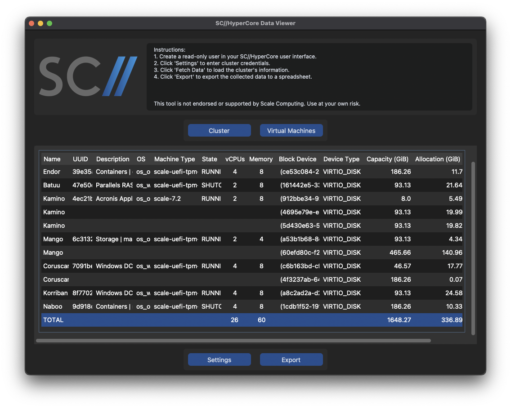

# HyperCore API Data Viewer

<!-- TABLE OF CONTENTS -->

  
Table of Contents

  <ol>
    <li><a href="#about">About The Project</a></li>
    <li><a href="#about">Screenshots</a></li>
    <li><a href="#instructions">Instructions</a></li>
    <li><a href="#disclaimer">Disclaimer</a></li>
    <li><a href="#disclaimer">Copyright</a></li>
    <li><a href="#roadmap">Roadmap</a></li>
    <li><a href="#contact">Contact</a></li>
  </ol>

<!-- ABOUT -->
## About
Tool to view and export informational data via the SC//HyperCore API for a [Scale Computing](https://www.scalecomputing.com) environment.

<!-- SCREENSHOTS -->
## Screenshots
 

<!-- INSTRUCTIONS -->
## Instructions
If you receive an error stating that Apple could not verify the app, do the following:
1. Ensure you downloaded the application from [this repository](https://github.com/thatseanwalsh/HyperCoreDataViewer/releases).
2. Then, on your Mac, choose Apple menu  > System Settings.
3. Next, click Privacy & Security in the sidebar. (You may need to scroll down.)
4. Go to Security, then click Open.
5. Click Open Anyway.
6. Enter your credentials, then click OK.

How to use the application:
1. Create a read-only user in your SC//HyperCore user interface.
2. Click 'Settings' to enter cluster credentials.
3. Click 'Fetch Data' to load the cluster's information.
4. Click 'Export' to export the collected data to a spreadsheet.

<!-- DISCLAIMER -->
## Disclaimer
This tool is not endorsed or supported by Scale Computing. Please use at your own risk.

<!-- COPYRIGHT -->
## Copyright
Scale Computing HyperCore and related images are registered trademarks/copyrights of [Scale Computing](https://www.scalecomputing.com/).

<!-- ROADMAP -->
## Roadmap
- [ ] Package for Windows
- [ ] Add a new tab for node-specific information
- [ ] See what else I can add that is of value

<!-- CONTACT -->
## Contact
Submit an issue/request: [Issues](https://github.com/thatseanwalsh/HyperCoreDataViewer/issues)

Project link: [https://github.com/thatseanwalsh/HyperCoreDataViewer](https://github.com/thatseanwalsh/HyperCoreDataViewer)

(<a href="#readme-top">back to top</a>)

